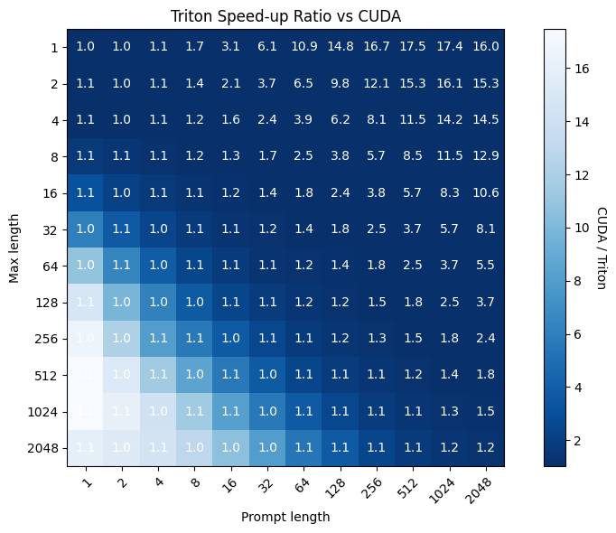

# GPTQ-triton

This is my attempt at implementing a Triton kernel for GPTQ inference.  This code is based on the [GPTQ-for-LLaMa](https://github.com/qwopqwop200/GPTQ-for-LLaMa) codebase, which is itself based on the [GPTQ](https://github.com/IST-DASLab/gptq) codebase.

```
@article{frantar-gptq,
  title={{GPTQ}: Accurate Post-training Compression for Generative Pretrained Transformers}, 
  author={Elias Frantar and Saleh Ashkboos and Torsten Hoefler and Dan Alistarh},
  year={2022},
  journal={arXiv preprint arXiv:2210.17323}
}
```

## Installation

`pip install .`


## Motivation

As of today (2023-03-27) the CUDA kernels in the aforementioned codebases do not scale well with context length, running up to 10x slower when the context is large versus the equivilent FP16 model.  To solve this I'm implementing the inference kernel in Triton, which should allow for much better scaling.

The implementation is based around the matmul tutorial from the Triton documentation.  The main difference is decoding the quantized weights before performing each sub-block of the matrix multiplication.

Fusing of the FF layers and QKV matrix are also applied.


## Performance

This benchmark was run on a 3090 using the `benchmark_generate.py` script.




## Accuracy (PPL)

The following results were obtained using the `ppl.py` script with a stride of 512 and a context length of 2048.
For the 4bit CUDA results, a custom version of `ppl.py` was used, as the current script is dedicated to the Triton kernel convensions.
it/s numbers are from a 3090.


| [LLaMA-7B](https://arxiv.org/abs/2302.13971)       | Bits | group-size | memory(MiB) | it/s | Wikitext2 |  PTB  |  C4  | 
| -------------------------------------------------- | ---- | ---------- | ----------- | ---- | --------- | ----- | ---- |
| FP16                                               |  16  |      -     |    17373    | 1.64 |    5.04   |  7.85 | 6.99 |
| GPTQ CUDA                                          |   4  |     -1     |     8805    | 0.11 |    5.44   |  8.24 |   -  |
| GPTQ Triton                                        |   4  |     -1     |     8099    | 1.63 |    5.44   |  8.24 | 7.48 |


| [LLaMA-13B](https://arxiv.org/abs/2302.13971)      | Bits | group-size | memory(MiB) | it/s | Wikitext2 |  PTB  |  C4  |
| -------------------------------------------------- | ---- | ---------- | ----------- | ---- | --------- | ----- | ---- |
| FP16                                               |  16  |      -     |    31633    |   -  |    4.52   |  7.19 | 6.66 |
| GPTQ Triton                                        |   4  |     -1     |    13241    | 0.89 |    4.74   |  7.49 | 7.00 |


| [LLaMA-30B](https://arxiv.org/abs/2302.13971)      | Bits | group-size | memory(MiB) | it/s | Wikitext2 |  PTB  |  C4  |
| -------------------------------------------------- | ---- | ---------- | ----------- | ---- | --------- | ----- | ---- |
| FP16                                               |  16  |      -     |    72491    |   -  |    3.61   |  6.50 | 6.07 |


## Requirements

See `setup.cfg`, but note that a nightly `transformers` is preferred right now. v4.28.1 might work.  Known working `transformers` commit is `28f26c107b4a1c5c7e32ed4d9575622da0627a40`.


## Quantizing a model

The `quantize.py` script is used to quantize a HuggingFace model.  Example usage:

`./quantize.py --model <Path to a HF FP16 model> --dataset c4 --wbits 4 --groupsize -1 --act-order --true-sequential --save <Path to the output folder>`

Arguments:

* `--model`: Path to a HF FP16 model
* `--dataset`: Dataset to use for calibration.  Can be `wikitext-2`, `ptb`, `ptb-new` or `c4`.
* `--seed`: Seed for sampling the calibration data.
* `--nsamples`: Number of calibration data samples.
* `--percdamp`: Percent of the average Hessian diagonal to use for dampening (default 0.01).
* `--wbits`: Number of bits to use for quantization.
* `--groupsize`: Groupsize to use for quantization; default (-1) uses full row.
* `--save`: Save quantized result to this folder.
* `--safetensors`: Save using the safetensors format.
* `--act-order`: Use activation order quantization.
* `--true-sequential`: Use true sequential quantization.

**NOTE:** The Triton kernel is currently only implemented for 4-bits and groupsize -1.

### Explanation of `groupsize`

The GPTQ quantization algorithm gets applied to `nn.Linear`, `nn.Conv2d`, and `transformers.Conv1d` layers.  (NOTE: `quantize.py` currently only supports LLaMA like models, and thus only `nn.Linear` layers are quantized, and `lm_head` is skipped.)  Each matrix is quantized into a quantized weight matrix, quantized zeros, and float16 scale (bias is not quantized).  During matmul, the weights are decoded using the formula `w = (w - z - 1) * s`.

Scales and zeros are per-outfeature, so when there is no grouping, scales and zeros would be `1xOutfeatures`.  That means that each row of the matrix (i.e. along the infeatures dimension) is quantized using the same scalar scale and zero.  When grouping is used, each row is split into `groupsize` values, and each group is quantized using its own scalar scale and zero.  This means that the scales and zeros are `(Infeatures//groupsize)xOutfeatures`.

Groupsize provides a tradeoff.  Lower groupsizes offer more granularity to the quantization and thus less loss of accuracy, but decrease the memory savings offered by quantization.

### Explanation of `nsamples` and `dataset`
nsamples and dataset effect the calibration data.  This input data is fed through the network during quantization to calibrate the algorithm.  See the GPTQ paper for more detail.

### Explanation of `true-sequential`
Models are quantized sequentially, one "layer" at a time.  For example, LLaMA 7B has 32 layers, starting after the input embedding, following by the head.  Each of these layers has many different Linear modules that can be quantized.  Without the `true-sequential` flag, these Linear modules will be quantized in an arbitrary order.  With the `true-sequential` flag, the Linear modules will be quantized in the order they would be encountered during a forward pass.  This can provide an accuracy boost.

### Explanation of `act-order`

I don't know.  Looking at the code (in `gptq.py`), it seems to re-order the matrix before quantization based on the `argsort` of the estimated `H`.  The order in which the matrix columns of the matrix are quantized might have an impact on final accuracy.  `act-order` was introduced by the GPTQ authors to improve accuracy when quantizing "small" models like LLaMA 7B.


## Files

* `benchmark_generate.py` - A script for benchmarking generation speed at different prompt lengths and generation lengths.

* `Benchmark.ipynb` - A notebook for benchmarking the Triton kernel against the CUDA kernel and FP16.

* `quantize.py` - A script for quantizing a model.

* `generate.py` - An example script for generating text from a model.  Example usage: `./generate.py --model <Path to your quantized model> --quant --prompt "Write a story about a duck: Once upon a time there was a duck" --temperature 0.6 --top-p 0.6 --repetition-penalty 1.1`

* `ppl.py` - A script for calculating the perplexity of a model against wikitext2, PTB, and C4.  This is useful for verifying correctness of the Triton kernel, comparing it to the CUDA kernel and the original FP16 model.

* `Verify.ipynb` - A notebook for verifying the correctness of the Triton kernel.